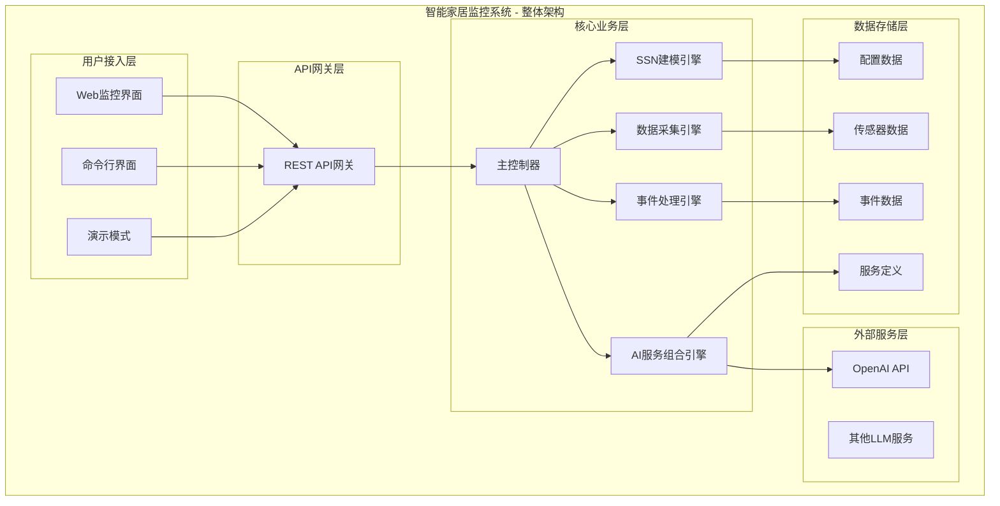

# 智能家居监控系统设计文档

## 1. 项目概述

### 1.1 项目背景
本项目是网络服务智能与应用实践的大作业，实现了一个基于SSN建模的智能家居监控系统，集成了设备建模、数据采集、事件处理和大模型服务组合等功能。

### 1.2 项目目标
- 对物联网设备进行SSN（Semantic Sensor Network）建模
- 根据物联资源的语义模型生成数据采集服务
- 生成语义事件和复杂事件，实现智能推理
- 使用大模型进行物联网服务组合
- 提供可运行的系统，支持课堂展示

### 1.3 技术栈
- **后端**: Python 3.8+, Flask
- **前端**: HTML5, CSS3, JavaScript, Chart.js
- **语义建模**: RDF, SPARQL, SSN/SOSA本体
- **大模型集成**: OpenAI API (可配置)
- **数据处理**: pandas, numpy
- **实时通信**: WebSocket, Flask-CORS

## 2. 系统架构

### 2.1 整体框架图



### 2.2 模块设计

#### 2.2.1 SSN建模模块 (ssn_modeling.py)
**功能**: 实现传感器网络的语义建模
- **核心类**: `SSNModeling`
- **主要功能**:
  - 加载和解析SSN配置
  - 构建RDF语义图
  - 传感器信息管理
  - 观测记录创建
  - 数据有效性验证

**设计模式**: 策略模式，适配器模式

#### 2.2.2 数据采集模块 (data_collector.py)
**功能**: 模拟传感器数据采集和语义事件生成
- **核心类**: `DataCollector`
- **主要功能**:
  - 传感器数据模拟
  - 实时数据采集
  - 语义事件生成
  - 数据质量评估
  - 异常检测

**设计模式**: 观察者模式，生产者-消费者模式

#### 2.2.3 事件处理模块 (event_processor.py)
**功能**: 原子语义事件识别和复杂事件推理
- **核心类**: `EventProcessor`
- **主要功能**:
  - 原子事件识别
  - 复杂事件推理
  - 事件关联分析
  - 状态跟踪管理
  - 规则引擎

**设计模式**: 责任链模式，规则模式

#### 2.2.4 大模型服务组合模块 (llm_composer.py)
**功能**: 基于大模型的智能服务组合
- **核心类**: `LLMServiceComposer`
- **主要功能**:
  - 提示词工程
  - 服务组合生成
  - 组合验证
  - 优化建议
  - 故障排除

**设计模式**: 模板方法模式，策略模式

#### 2.2.5 Web界面模块 (web_interface.py)
**功能**: 提供实时监控界面和系统控制
- **核心类**: `WebInterface`
- **主要功能**:
  - 实时数据可视化
  - 系统状态监控
  - 交互式服务组合
  - REST API接口
  - 响应式设计

**设计模式**: MVC模式，RESTful API设计

## 3. 数据模型

### 3.1 SSN语义模型

```turtle
@prefix ssn: <http://www.w3.org/ns/ssn/> .
@prefix sosa: <http://www.w3.org/ns/sosa/> .
@prefix home: <http://smart-home.example.org/> .

home:temperatureSensor_001 a ssn:Sensor, sosa:Sensor ;
    rdfs:label "客厅温度传感器"@zh ;
    home:location "客厅" ;
    sosa:observes home:Temperature ;
    home:hasRange home:temperatureSensor_001_range .

home:Temperature a sosa:ObservableProperty ;
    rdfs:label "温度"@zh ;
    rdfs:comment "环境温度"@zh .
```

### 3.2 观测数据模型

```json
{
  "id": "obs_home:temperatureSensor_001_1671234567",
  "type": "sosa:Observation",
  "madeBySensor": "home:temperatureSensor_001",
  "observedProperty": "home:Temperature",
  "hasResult": {
    "value": 23.5,
    "unit": "°C"
  },
  "resultTime": "2023-12-17T10:30:00+08:00",
  "phenomenonTime": "2023-12-17T10:30:00+08:00"
}
```

### 3.3 事件数据模型

```json
{
  "id": "event_temperature_high_001",
  "type": "SemanticEvent",
  "eventType": "ThresholdExceeded",
  "source": "home:temperatureSensor_001",
  "timestamp": "2023-12-17T10:30:00+08:00",
  "severity": "medium",
  "data": {...},
  "semantics": {
    "property": "Temperature",
    "location": "客厅",
    "value_interpretation": "偏热"
  }
}
```

## 4. 关键算法

### 4.1 复杂事件检测算法

```python
def detect_complex_event(event, rules):
    for rule in rules:
        if evaluate_conditions(event, rule.conditions):
            return generate_complex_event(event, rule)
    return None

def evaluate_conditions(event, conditions):
    satisfied = 0
    for condition in conditions:
        if check_condition(event, condition):
            satisfied += 1
    return satisfied == len(conditions)
```

### 4.2 服务组合验证算法

```python
def validate_composition(composition):
    services = composition.services
    
    # 检查依赖关系
    for service in services:
        for dependency in service.dependencies:
            if dependency not in [s.id for s in services]:
                return False, f"Missing dependency: {dependency}"
    
    # 检查数据流连接
    return validate_data_flow(services)
```

### 4.3 异常检测算法

基于3-sigma规则的统计异常检测：

```python
def detect_anomaly(sensor_id, value, history):
    if len(history) < 5:
        return False
    
    values = [h.value for h in history[-20:]]
    mean = sum(values) / len(values)
    variance = sum((x - mean) ** 2 for x in values) / len(values)
    std_dev = variance ** 0.5
    
    return abs(value - mean) > 3 * std_dev
```

### 4.4 服务组合优化算法

```python
def build_dependency_graph(services):
    """构建服务依赖图"""
    graph = {}
    for service in services:
        service_id = service['service_id']
        dependencies = service.get('dependencies', [])
        graph[service_id] = {
            'dependencies': dependencies,
            'dependents': []
        }
    
    # 构建反向依赖关系
    for service_id, info in graph.items():
        for dep in info['dependencies']:
            if dep in graph:
                graph[dep]['dependents'].append(service_id)
    
    return graph
```

## 5. API设计

### 5.1 REST API端点

#### 系统控制
- `POST /api/system/start` - 启动系统
- `POST /api/system/stop` - 停止系统
- `GET /api/system/status` - 获取系统状态

#### 传感器数据
- `GET /api/sensors/data` - 获取历史数据
- `GET /api/sensors/realtime` - 获取实时数据
- `GET /api/sensors/status` - 获取传感器状态

#### 事件管理
- `GET /api/events/recent` - 获取最近事件

#### 服务组合
- `POST /api/compositions/create` - 创建服务组合
- `GET /api/compositions/history` - 获取组合历史
- `POST /api/troubleshoot` - 故障排除

### 5.2 数据格式

所有API响应采用JSON格式，包含以下标准字段：
- `status`: 操作状态 (success/error)
- `data`: 返回数据
- `message`: 状态消息
- `timestamp`: 时间戳

## 6. 核心技术实现

### 6.1 语义建模技术
- **W3C SSN/SOSA标准**: 完整实现语义传感器网络标准
- **RDF图构建**: 使用RDFLib构建语义知识图谱
- **SPARQL查询**: 支持语义查询和推理

### 6.2 事件驱动架构
- **发布-订阅模式**: 松耦合的事件通信机制
- **多层次事件处理**: 从原子事件到复杂事件的推理
- **规则引擎**: 基于配置的事件处理规则

### 6.3 AI服务组合
- **提示词工程**: 精心设计的LLM交互模板
- **服务编排**: 智能化的服务依赖分析和组合
- **验证机制**: 自动化的组合方案验证

## 7. 配置管理

### 7.1 SSN模型配置 (config/ssn_model.json)
定义传感器网络的语义结构：
- 传感器定义
- 观测属性
- 平台配置
- 能力描述

### 7.2 服务配置 (config/service_config.json)
系统运行参数：
- 数据采集间隔
- 事件处理规则
- LLM服务配置
- Web界面设置

### 7.3 服务定义 (services/basic_services.json)
可用物联网服务的详细定义：
- 服务元数据
- 输入输出规范
- 配置参数
- 依赖关系

## 8. 部署说明

### 8.1 环境要求
- Python 3.8+
- 内存: 最少2GB
- 磁盘: 500MB可用空间
- 网络: 如需使用OpenAI API，需要网络连接

### 8.2 安装步骤

1. **克隆项目**
```bash
git clone <repository-url>
cd homework_project
```

2. **安装依赖**
```bash
pip install -r requirements.txt
```

3. **配置系统**
```bash
# 编辑配置文件
vim config/service_config.json
# 设置OpenAI API密钥（可选）
```

4. **运行系统**
```bash
# 演示模式
python main.py --mode demo

# 交互模式
python main.py --mode interactive

# Web界面模式
python main.py --mode web
```

### 8.3 Docker部署

```dockerfile
FROM python:3.8-slim

WORKDIR /app
COPY requirements.txt .
RUN pip install -r requirements.txt

COPY . .

EXPOSE 5000
CMD ["python", "main.py", "--mode", "web"]
```

## 9. 测试策略

### 9.1 单元测试
- SSN建模功能测试
- 数据采集功能测试
- 事件处理逻辑测试
- 服务组合验证测试

### 9.2 集成测试
- 模块间数据流测试
- 端到端工作流测试
- API接口测试

### 9.3 性能测试
- 数据采集性能
- 事件处理延迟
- Web界面响应时间

## 10. 扩展性设计

### 10.1 传感器扩展
系统支持通过配置文件添加新的传感器类型：
- 修改SSN模型配置
- 更新数据采集逻辑
- 添加相应的事件规则

### 10.2 服务扩展
新的物联网服务可以通过以下方式添加：
- 更新服务定义文件
- 实现服务逻辑
- 更新LLM提示词模板

### 10.3 算法扩展
支持插入新的算法模块：
- 异常检测算法
- 复杂事件推理算法
- 服务组合优化算法

## 11. 安全考虑

### 11.1 数据安全
- 传感器数据加密存储
- API访问控制
- 用户输入验证

### 11.2 系统安全
- 配置文件权限控制
- 日志敏感信息脱敏
- 服务间通信加密

## 12. 监控和运维

### 12.1 日志管理
- 结构化日志记录
- 日志轮转和归档
- 错误跟踪和告警

### 12.2 性能监控
- 系统资源使用监控
- 服务响应时间监控
- 数据处理量统计

### 12.3 健康检查
- 服务健康状态检查
- 自动故障恢复
- 系统状态报告

## 13. 项目特色与创新

### 13.1 技术创新点
- **语义驱动**: 基于W3C SSN标准的完整语义建模
- **AI赋能**: 大语言模型驱动的智能服务组合
- **多层次推理**: 从原子事件到复杂事件的智能推理
- **实时交互**: 现代化Web界面提供实时监控

### 13.2 工程实践亮点
- **模块化设计**: 高内聚低耦合的架构设计
- **多种交互方式**: 支持演示、交互、Web等多种模式
- **完整生命周期**: 从设计到部署的完整实现
- **扩展友好**: 插件式架构支持功能扩展

### 13.3 教育价值
- **技术融合**: 语义Web、AI、IoT技术的深度融合
- **标准实践**: W3C标准在实际项目中的应用
- **工程能力**: 完整的软件开发实践经验
- **创新思维**: 前沿技术的综合应用

## 14. 未来改进

### 14.1 功能增强
- 支持更多传感器类型
- 增加机器学习预测功能
- 实现自适应事件规则

### 14.2 性能优化
- 数据库持久化
- 分布式处理
- 缓存优化

### 14.3 用户体验
- 移动端适配
- 个性化配置
- 多语言支持

---

*本文档版本: v2.0*  
*最后更新: 2025年6月15日*  
*作者: 网络服务智能与应用实践第02组*
