# 智能家居监控系统

## 小组成员及分工：

张三：SSN建模，语义传感器网络构建

李四：物联网服务系统，数据采集与事件处理

王五：大模型服务组合，AI接口集成

赵六：前端展示，Web界面开发

## 摘要

本文设计了一种基于语义传感器网络(SSN)和大语言模型的智能家居监控系统，旨在提高物联网设备管理和智能服务组合的效率。通过结合SSN语义建模技术和大模型的自然语言处理能力，我们提出了一种新的智能物联网管理方法。该方法包括以下几个关键步骤：首先建立基于W3C SSN/SOSA标准的物联网设备语义模型；接下来构建物联网服务系统实现数据采集和事件处理；然后借助大语言模型进行智能服务组合；最后通过现代化前端界面提供实时监控和可视化展示。

通过上述步骤，本文实现了从物联网设备建模到事件处理，再到智能服务组合和用户交互的完整流程，为智能家居应用提供了一种高效、智能的管理方法。具体应用场景如温湿度自动调节、火灾安全监控等，验证了该方法的有效性和实用性。

## 系统整体架构


*图1: 智能家居监控系统整体架构图 - 显示系统的分层设计和各模块间的关系*

系统采用分层架构设计，包含用户接入层、API网关层、核心业务层、数据存储层、外部服务层和基础设施层。每一层都有明确的职责分工，实现了高内聚低耦合的设计目标。


*图2: 系统运行流程图 - 展示从数据采集到服务组合的完整工作流程*

## SSN建模

### 语义模型构建

W3C SSN/SOSA作为语义传感器网络的国际标准，能够描述传感器类、观测实例、属性关系、数据类型等信息。在本项目中，我们使用RDF（Resource Description Framework）作为描述语言，构建智能家居设备的语义模型。

```mermaid
graph TB
    subgraph "SSN本体结构"
        subgraph "核心类 (Core Classes)"
            SENSOR[传感器类<br/>ssn:Sensor<br/>sosa:Sensor]
            OBS[观测类<br/>sosa:Observation]
            PROP[属性类<br/>sosa:ObservableProperty]
            PLATFORM[平台类<br/>sosa:Platform]
        end
        
        subgraph "智能家居传感器"
            TEMP[温度传感器<br/>home:TemperatureSensor]
            HUMID[湿度传感器<br/>home:HumiditySensor]
            SMOKE[烟雾传感器<br/>home:SmokeSensor]
            MOTION[运动传感器<br/>home:MotionSensor]
            LIGHT[光照传感器<br/>home:LightSensor]
        end
        
        subgraph "观测属性"
            TEMP_PROP[温度<br/>home:Temperature]
            HUMID_PROP[湿度<br/>home:Humidity]
            SMOKE_PROP[烟雾浓度<br/>home:SmokeLevel]
            MOTION_PROP[运动状态<br/>home:Motion]
            LIGHT_PROP[光照强度<br/>home:Illuminance]
        end
        
        subgraph "数据属性"
            RANGE[值域范围<br/>home:hasRange]
            UNIT[测量单位<br/>home:hasUnit]
            ACCURACY[测量精度<br/>home:hasAccuracy]
            LOCATION[安装位置<br/>home:hasLocation]
        end
    end
    
    %% 关系连接
    TEMP -.继承.-> SENSOR
    HUMID -.继承.-> SENSOR
    SMOKE -.继承.-> SENSOR
    MOTION -.继承.-> SENSOR
    LIGHT -.继承.-> SENSOR
    
    TEMP -.观测.-> TEMP_PROP
    HUMID -.观测.-> HUMID_PROP
    SMOKE -.观测.-> SMOKE_PROP
    MOTION -.观测.-> MOTION_PROP
    LIGHT -.观测.-> LIGHT_PROP
    
    OBS -.由传感器产生.-> SENSOR
    OBS -.观测属性.-> PROP
    
    SENSOR -.部署在.-> PLATFORM
    
    SENSOR -.拥有.-> RANGE
    SENSOR -.拥有.-> UNIT
    SENSOR -.拥有.-> ACCURACY
    SENSOR -.拥有.-> LOCATION
    
    %% 样式
    classDef coreClass fill:#e3f2fd,stroke:#1976d2,stroke-width:2px
    classDef sensorClass fill:#e8f5e8,stroke:#388e3c,stroke-width:2px
    classDef propClass fill:#fff3e0,stroke:#f57c00,stroke-width:2px
    classDef dataClass fill:#fce4ec,stroke:#c2185b,stroke-width:2px
    
    class SENSOR,OBS,PROP,PLATFORM coreClass
    class TEMP,HUMID,SMOKE,MOTION,LIGHT sensorClass
    class TEMP_PROP,HUMID_PROP,SMOKE_PROP,MOTION_PROP,LIGHT_PROP propClass
    class RANGE,UNIT,ACCURACY,LOCATION dataClass
```



*图3: SSN本体结构图 - 显示传感器、观测属性、平台等核心概念及其关系*

#### 核心概念定义

在构建语义本体时，涉及以下重要概念：

- **传感器类（Sensor Class）**：对设备类型的抽象描述
- **观测实例（Observation）**：具体的测量记录
- **属性关系（Property）**：传感器与观测属性之间的联系
- **数据属性（DataProperty）**：定义观测值的属性和值域范围

#### 传感器类型定义

根据智能家居应用场景，我们定义了五种主要的传感器类型：

| 传感器类型 | URI标识 | 描述 | 观测属性 | 值域范围 |
|-----------|---------|------|----------|----------|
| 温度传感器 | home:TemperatureSensor | 监测环境温度 | home:Temperature | -20°C ~ 50°C |
| 湿度传感器 | home:HumiditySensor | 监测环境湿度 | home:Humidity | 0% ~ 100%RH |
| 烟雾传感器 | home:SmokeSensor | 检测烟雾浓度 | home:SmokeLevel | 0 ~ 1000ppm |
| 运动传感器 | home:MotionSensor | 检测人体活动 | home:Motion | true/false |
| 光照传感器 | home:LightSensor | 监测光照强度 | home:Illuminance | 1 ~ 65535lux |


*图4: 传感器配置界面截图 - 显示SSN模型配置文件的管理界面*

#### 语义模型实现

使用RDFLib库实现语义模型构建，主要包括以下功能：

```python
class SSNModeling:
    def create_observation(self, sensor_id: str, value: float, timestamp):
        """创建符合SOSA标准的观测记录"""
        # 实现观测记录创建逻辑
        
    def validate_sensor_value(self, sensor_id: str, value: float) -> bool:
        """基于语义模型验证传感器数值"""
        # 实现数据验证逻辑
```


*图5: RDF语义图可视化界面 - 展示构建的语义网络图形化表示*

#### 语义约束验证

系统实现了基于语义模型的数据验证机制，确保采集的传感器数据符合预定义的约束条件。当数据超出有效范围时，系统会自动标记并生成相应的警告信息。


*图6: 数据验证结果界面 - 显示传感器数据的语义验证状态和结果*

## 物联网服务系统

### 数据采集服务

数据采集模块负责模拟传感器数据采集和语义事件生成，采用事件驱动架构实现松耦合设计。该模块是整个系统的数据源头，为后续的事件处理和服务组合提供基础数据支撑。


*图7: 数据采集架构图 - 展示数据采集模块的内部结构和工作原理*

#### 数据采集流程

```python
class DataCollector:
    def start_continuous_collection(self):
        """启动持续数据采集"""
        # 启动数据采集服务
        
    def generate_semantic_event(self, observation: Dict) -> Dict:
        """生成语义事件"""
        # 基于观测数据生成语义事件
```


*图8: 实时数据采集监控界面 - 显示各传感器的实时数据采集状态*

#### 异常检测机制

系统采用3-sigma规则进行统计异常检测，结合语义约束验证，实现多层次的数据质量控制。当检测到异常数据时，系统会自动标记并触发相应的处理流程。


*图9: 异常检测结果展示 - 显示检测到的异常数据和处理状态*

### 事件处理服务

实现多层次事件处理架构，从原子事件到复杂事件推理。系统能够识别简单的传感器事件，并通过规则引擎生成更高层次的复杂事件。


*图10: 事件处理流程图 - 展示从原子事件到复杂事件的处理流程*

#### 复杂事件推理

```python
class EventProcessor:
    def process_semantic_event(self, event: Dict) -> List[Dict]:
        """处理语义事件，生成复杂事件"""
        # 应用事件规则生成复杂事件
```

#### 事件规则配置

系统预定义了多种事件处理规则，包括火灾风险检测、环境异常判断、安全警报等。用户可以通过配置界面自定义新的事件规则。


*图11: 事件规则配置界面 - 显示复杂事件规则的定义和管理*

#### 事件关联分析


*图12: 事件关联分析可视化 - 展示不同事件之间的时间和空间关联关系*

## 大模型服务组合

### 服务组合架构

利用大语言模型的自然语言理解能力，实现从用户需求到技术方案的自动转换。该模块是系统的智能化核心，体现了AI技术在物联网服务编排中的应用。


*图13: 服务组合架构图 - 展示大模型服务组合模块的整体设计*

#### 核心组件设计

```python
class LLMServiceComposer:
    def compose_services(self, target_goal: str, sensor_data: Dict = None, 
                        constraints: List[str] = None) -> Dict:
        """基于用户目标生成服务组合方案"""
        # 调用大模型生成服务组合
```


*图14: LLM接口调用示例 - 显示与OpenAI API的交互过程*

#### 提示词工程

系统设计了专门的提示词模板来指导大模型生成高质量的服务组合方案。提示词包含了目标需求、传感器数据、可用服务列表和约束条件等关键信息。


*图15: 提示词工程设计界面 - 展示提示词模板的设计和优化过程*

#### 可用服务管理

系统预定义了多种物联网服务，包括监控类、安全类、舒适度管理类、能源优化类和通信类服务。用户可以根据需要扩展新的服务定义。


*图16: 可用服务管理界面 - 显示系统中定义的各类物联网服务*

#### 服务组合验证


*图17: 服务组合验证流程图 - 展示生成方案的可行性验证过程*


*图18: 服务组合验证结果界面 - 展示验证结果和优化建议*

#### 组合方案示例


*图19: AI生成的服务组合方案示例 - 显示完整的服务编排方案*

## 前端展示

### Web界面架构

基于Flask框架构建现代化的Web监控界面，提供实时数据可视化和系统控制功能。前端采用响应式设计，支持多设备访问。


*图20: Web界面架构图 - 展示前端技术栈和组件结构*

#### 主控制面板

```python
class WebInterface:
    def _setup_routes(self):
        """设置路由"""
        # 配置Web路由和API接口
```


*图21: 系统主控制面板 - 显示系统状态、控制按钮和统计信息*

#### 实时数据监控

系统提供实时的传感器数据可视化，使用Chart.js库实现动态图表展示。用户可以实时查看各类传感器的数据变化趋势。


*图22: 实时数据监控界面 - 展示传感器数据的实时图表和数值显示*

#### 传感器状态面板


*图23: 传感器状态面板 - 显示各传感器的在线状态和当前数值*

#### 事件管理界面

```javascript
function updateEventList() {
    // 更新事件列表显示
}
```


*图24: 事件管理界面 - 展示系统事件的分类、过滤和详细信息*

#### AI服务组合界面


*图25: AI智能服务组合界面 - 显示需求输入、方案生成和结果展示*

#### 组合结果展示


*图26: 服务组合结果展示 - 以Markdown格式展示AI生成的详细方案*

#### 响应式设计展示


*图27: 移动端界面适配 - 展示在不同设备上的响应式布局效果*

#### 系统配置界面


*图28: 系统配置界面 - 显示系统参数设置和模型配置选项*

### 部署与运行

#### 本地运行截图


*图29: 本地部署运行截图 - 显示系统启动过程和运行状态*

#### Docker部署


*图30: Docker容器化部署 - 展示容器构建和运行过程*

### 系统测试结果

#### 功能测试


*图31: 功能测试结果 - 展示各模块功能的测试覆盖率和通过情况*

#### 性能测试


*图32: 性能测试结果 - 显示系统在不同负载下的响应时间和资源使用情况*

## 应用场景演示

### 火灾安全监控场景


*图33: 火灾安全监控场景演示 - 展示系统检测火灾风险并生成应急方案的过程*

### 智能环境调节场景


*图34: 智能环境调节场景演示 - 显示系统根据环境参数自动调节的效果*

## 总结与展望

通过以上四个核心模块的实现，我们构建了一个完整的智能家居监控系统，实现了从语义建模到前端展示的全流程智能化管理。系统成功验证了语义Web技术与大模型技术结合在物联网领域的应用价值，为智能家居的发展提供了新的技术路径。


*图35: 项目成果总结 - 展示系统的主要功能特点和技术创新点*

未来我们将继续完善系统功能，扩展更多的传感器类型支持，优化AI模型的服务组合能力，并探索系统在更广泛物联网场景中的应用。
